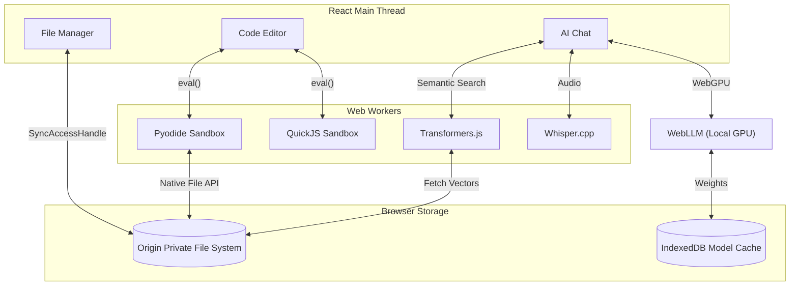

# Architecture

## COOP & COEP Isolation

To enable high-performance features like `SharedArrayBuffer` (which WebAssembly often requires), this project utilizes Cross-Origin Isolation headers. 
When running locally or deploying, ensure the server emits the following headers:
- `Cross-Origin-Opener-Policy: same-origin`
- `Cross-Origin-Embedder-Policy: require-corp`

Vite handles this automatically during development via its plugin configuration.

## Web Workers and Sandboxing
- **QuickJS**: JavaScript is executed in a secure QuickJS sandbox using WebAssembly, ensuring main-thread stability.
- **Pyodide**: Python scripts run using Pyodide in a dedicated Web Worker.
- **AI and RAG**: WebLLM and Transformers.js run inside separate Web Workers (and utilize WebGPU where applicable) to prevent blocking the UI thread during heavy model inference or embedding generation.
- **OPFS Workspace**: File operations leverage the Origin Private File System via a dedicated worker, allowing true filesystem access and binary handling capabilities from the sandboxed languages.

## System Architecture

