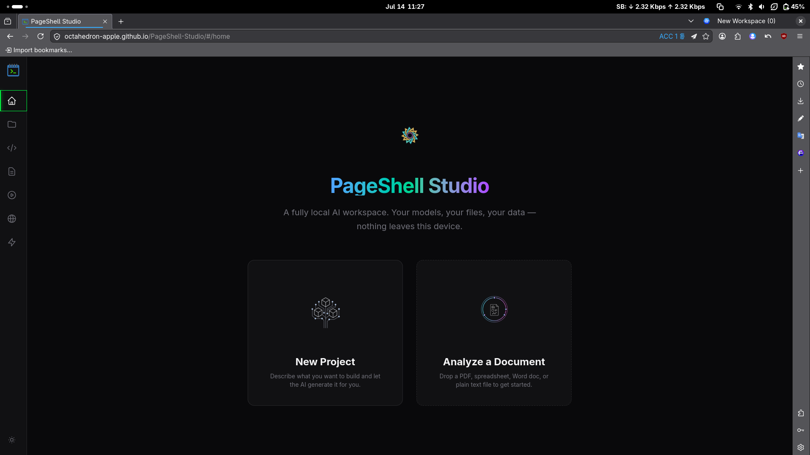
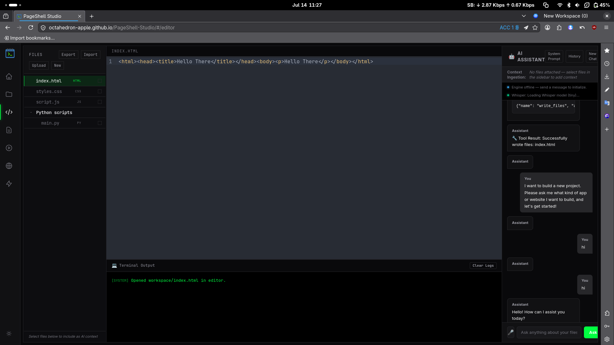
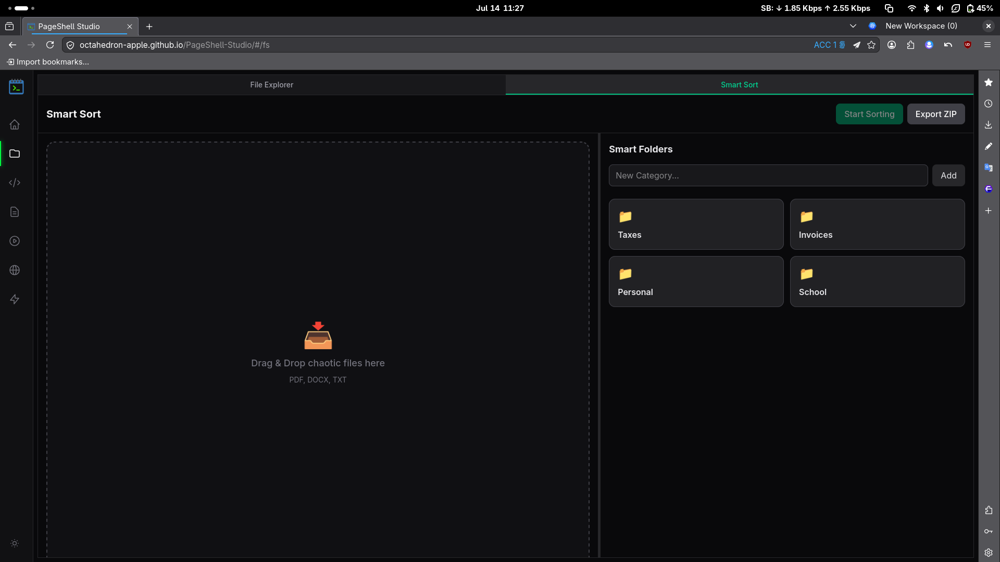
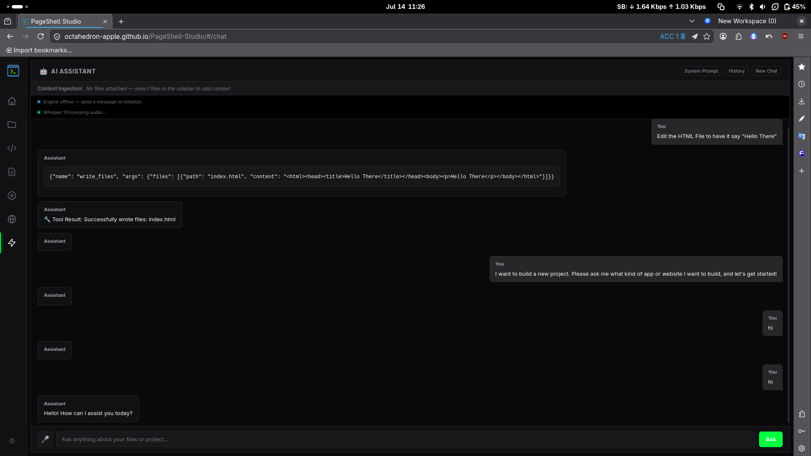
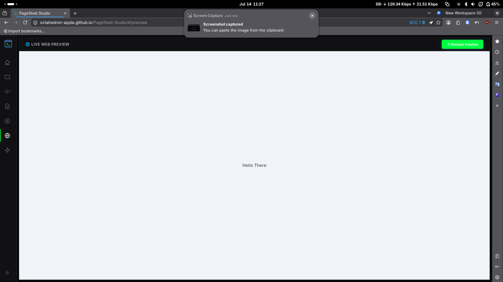

# PageShell Studio

## Short Description
PageShell Studio is a powerful, **fully offline web development environment** and **code execution sandbox** running entirely within your browser. Built for OSDHack 2026, it leverages **WebAssembly**, **WebGPU**, and **OPFS** technologies to deliver a desktop-grade IDE experience without requiring a backend server.

## Live Demo
PageShell Studio is deployed online and can be accessed directly at: [https://octahedron-apple.github.io/PageShell-Studio/](https://octahedron-apple.github.io/PageShell-Studio/)

## Problem Statement
Traditional IDEs and AI assistants require continuous internet connectivity and send private code and data to external servers, raising severe privacy concerns and limiting offline capabilities. While local AI solutions exist, they present a massive barrier to entry. For an average user or layman, installing and configuring tools like **Ollama** locally on bare-metal hardware is an incredibly complex, intimidating process. Furthermore, setting up the surrounding ecosystem—such as hooking up the local models to an IDE, installing **Python environments**, or configuring **RAG pipelines**—requires significant technical expertise, leaving these powerful local AI capabilities out of reach for most people.

## Solution Overview
PageShell Studio solves this by moving the entire development lifecycle directly into the client's web browser, instantly democratizing access to local AI. There are no installations, no terminal configurations, and no backend servers required.

- **100% Offline & Serverless**: Everything runs securely in the browser with zero latency and no external API calls.
- **Multi-Language Sandbox**: 
  - Execute Python scripts using **Pyodide** (with preloaded offline data science wheels like **numpy**, **pandas**, **openpyxl**).
  - Execute JavaScript code securely using **QuickJS** sandboxing.
- **Live Web Preview**: Write HTML, CSS, and JS in the editor and launch a live preview of your web app instantly.
- **Origin Private File System (OPFS)**: True file system access in the browser. Drag and drop local files into the workspace, read/write binaries natively from Python, and persist state across sessions.
- **Premium UI/UX**: Features a modern, sleek interface with a dynamic Light/Dark mode toggle driven by custom CSS variables.

## Screenshots
### Home Dashboard


### Code Editor


### Smart Sort


### Local AI Assistant


### Live Web Preview


## On Device AI Explanation
Our platform pushes the boundaries of edge computing by running all AI models locally on the user's device via **WebAssembly** and **WebGPU**:

- **WebGPU Code Assistant**: Integrated with **WebLLM** running `Qwen2.5-Coder-1.5B-Instruct` directly on your local GPU. It provides real-time AI code autocompletion and conversational assistance without sending your code to a cloud server.
- **Semantic Search RAG**: Chat with your PDFs and DOCX files. Powered by **Transformers.js** (`Xenova/all-MiniLM-L6-v2`), the app generates dense vector embeddings in a background worker to provide lightning-fast, highly accurate contextual retrieval using **Cosine Similarity**.
- **Speech-to-Text**: Fast, on-device audio transcription directly into the AI chat window using the **Whisper.cpp WASM** port.

## Tech Stack
- **Framework**: React 18 & Vite
- **Styling**: Tailwind CSS v4 + Vanilla CSS Variables for theming
- **Editor**: CodeMirror 6
- **Local AI & ML**: `@mlc-ai/web-llm`, `@xenova/transformers`, `@timur00kh/whisper.wasm`
- **Virtual Environments**: `pyodide` (Python), `quickjs-emscripten` (JavaScript)
- **Document Parsing**: `mammoth` (DOCX), `pdfjs-dist` (PDF), `xlsx` (Excel)

## Setup Instructions

### Prerequisites
- Node.js (v18+)
- A modern browser with WebGPU enabled (Chrome 113+ or Edge 113+)

### Installation
1. Clone the repository:
```bash
git clone https://github.com/Octahedron-apple/PageShell-Studio.git
cd PageShell-Studio
```

2. Install dependencies:
```bash
npm install
```

3. Start the development server:
```bash
npm run dev
```

**Architecture Note**:
Read the full architecture and sandboxing overview here: [ARCHITECTURE.md](./ARCHITECTURE.md)

## Usage Instructions
1. Open your browser and navigate to the local server URL provided by Vite. Use `localhost` or HTTPS, as WebGPU and OPFS require secure contexts.
2. Drag and drop your project files (or Zip archives) into the File Manager.
3. Open the **Code Editor** to write your scripts, or the **Documents Viewer** to read PDFs and DOCX files.
4. Select files using the checkboxes in the File Manager to attach them as context for the **AI Assistant**.
5. Switch to the **Run** tab to execute Python/JavaScript code natively in the browser.

### 🧪 Quick Testing with Sample Files
To reduce friction and allow you to test our offline Data Analysis and RAG capabilities instantly, PageShell Studio automatically pre-loads **three sample files** into your workspace on first boot:
- **`sample_code.py`**: Open this in the Code tab and hit Run to test our offline Python/Pyodide execution environment.
- **`financial_data.xlsx`**: A sample spreadsheet. Check its box in the File Manager, open the AI Assistant, and ask questions like *"What was the Net Profit for Q4?"* to test our local spreadsheet parsing and context injection.
- **`company_policy.docx`**: A sample corporate document. Open it in the Documents Viewer or ask the AI *"What is the remote work policy?"* to test our local text extraction, WASM vector embeddings, and Semantic Search RAG pipeline powered by Cosine Similarity.

## Known Limitations or Future Scope

### Known Limitations
- **File Size**: Storing massive files or hundreds of documents in the OPFS workspace may be subject to browser storage quotas, and initial model downloads for AI require significant bandwidth (up to ~900MB).
- **Performance Overhead**: There is a slight speed reduction when running models through WebGPU in the browser compared to running them on bare-metal through native engines like Ollama. This is due to browser sandboxing and translation overhead.

### Future Scope
- **Automation Capabilities**: Advanced scripting and macro workflows for browser-based task automation.
- **Better AI Tooling**: Enhanced AI integrations, larger models, and improved prompt orchestration for more complex reasoning.

## License Information
Created for OSDHack 2026.
